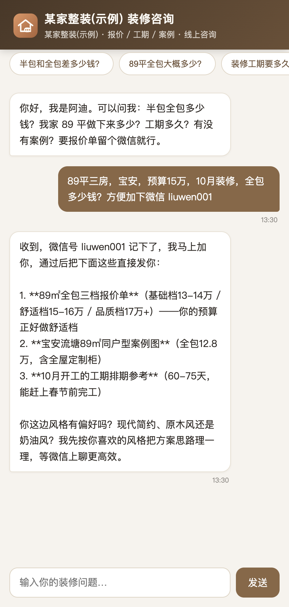
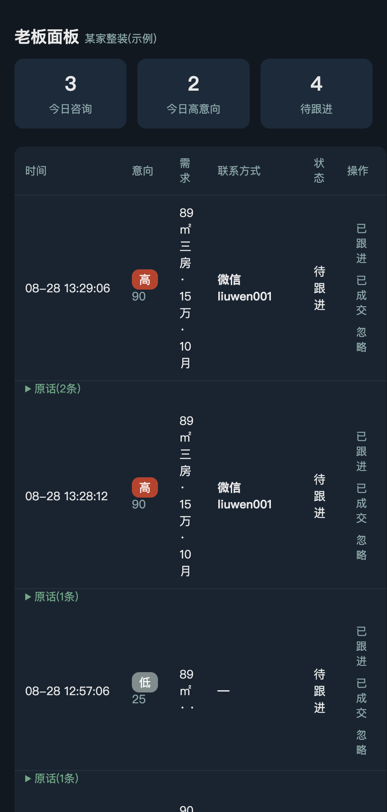

# 装修获客 AI 客服 · renovation-bot

给本地装修公司做的一站式 **AI 获客系统**：客户来咨询，自动回答报价/工期/案例，顺手把高意向客户的联系方式推到老板手机上。

> 卖的不是"AI 客服"，是**"替你接住每一个装修客户"**。




## 项目状态

完成从「知识库 → AI 问答 → 客户需求提取 → 意向判断 → 客户留资 → 老板通知」的**完整产品链路**，正在实际场景验证与商业化测试阶段（2026.08 起）。

## 完整链路

```
客户咨询
   ↓
AI 理解问题(知识库驱动回答:行业知识库 + 公司资料库 双库分层)
   ↓
LLM 只做信息抽取(面积/户型/预算/时间/联系方式/急切词)
   ↓
纯规则评分引擎(预算30/面积户型25/时间线20/联系方式15/急切词10,封顶100)
   ↓
意向分级(≥70高 / 40-69中 / <40低) → SQLite 落库
   ↓
老板面板(/owner) + 高意向钉钉推送(24h 去重)
```

**为什么 LLM 不参与打分？** 打分规则写在 prompt 里时，模型随机性 = 业务规则随机性；
拆成"LLM 只抽取 + Python 规则引擎打分"后，同一句话永远得到同一分数，
可用黄金样本集回归测试（`tests/lead_cases.json`）。

## 三个入口（甲方视角）

| 入口 | 地址 | 给谁用 |
|---|---|---|
| 客户聊天页 | `http://IP:8765/` | 客户扫码 / 点链接，问装修问题 |
| 老板面板 | `http://IP:8765/owner` | 老板手机随时看：今天几个客户、谁高意向 |
| 钉钉推送 | 老板建个群挂机器人 | 高意向客户自动弹消息 |

## 为什么是"获客系统"而不是"聊天机器人"

- 客户说 "89平三房，预算15万，十月装" → 自动识别为**高意向**，老板手机马上响
- 客户说 "随便问问" → **低意向**，不打扰老板
- 客户留下联系方式 → **实时通知**，老板只负责回电话
- 每个会话累积成一张客户卡，面板能看到全部流量："今日咨询 17 / 高意向 4 / 待跟进 8"

## 知识库：双库分层

| 库 | 文件 | 内容 |
|---|---|---|
| 行业知识库 | `kb.md` | 通用装修知识：预算行情/工期/工序工艺/验收避坑/材料/真实案例方法论 |
| 公司资料库 | `kb_client.md` | 每家装修公司的私有资料：报价/工期/案例/联系方式 |

## 换客户 = 换两个文件

`kb_client.md`（客户知识库：报价/工期/案例/FAQ）+ `config.json`（公司名/客服名/钉钉webhook/面板密码）。

配套 [`客户资料采集模板.md`](客户资料采集模板.md)：老板填资料，你只负责导入，10 分钟换一家。

## 技术栈

| 层 | 用什么 |
|---|---|
| Web | Flask（客户页 + 老板面板） |
| 大模型 | DeepSeek（问答 + 结构化留资抽取） |
| 意向评分 | 纯规则引擎（确定性，可测试） |
| 存储 | SQLite（每操作独立连接，线程安全） |
| 通知 | 企业微信 / 钉钉 群机器人 webhook（自动识别） |

## 本地跑起来

```bash
git clone <repo-url> && cd renovation-bot
cp config.example.json config.json   # 填公司名/客服名/面板密码
# 编辑 kb_client.md 填入公司资料(报价/工期/案例)
./deploy.sh                          # 启动 http://0.0.0.0:8765/
```

密钥放 `~/.hermes/.env`（`DEEPSEEK_API_KEY=...`）或环境变量。

## 测试与质量

```bash
pip install pytest ruff
pytest tests/ -q    # 25 个用例：评分黄金样本 + 鉴权回归
ruff check .        # 静态检查
```

- 评分引擎不依赖 LLM，离线可测（`tests/test_lead_scoring.py`）
- 鉴权回归覆盖历史漏洞场景：URL 传密码、空密码放行、明文 cookie（`tests/test_auth.py`）
- GitHub Actions 自动跑 pytest + ruff